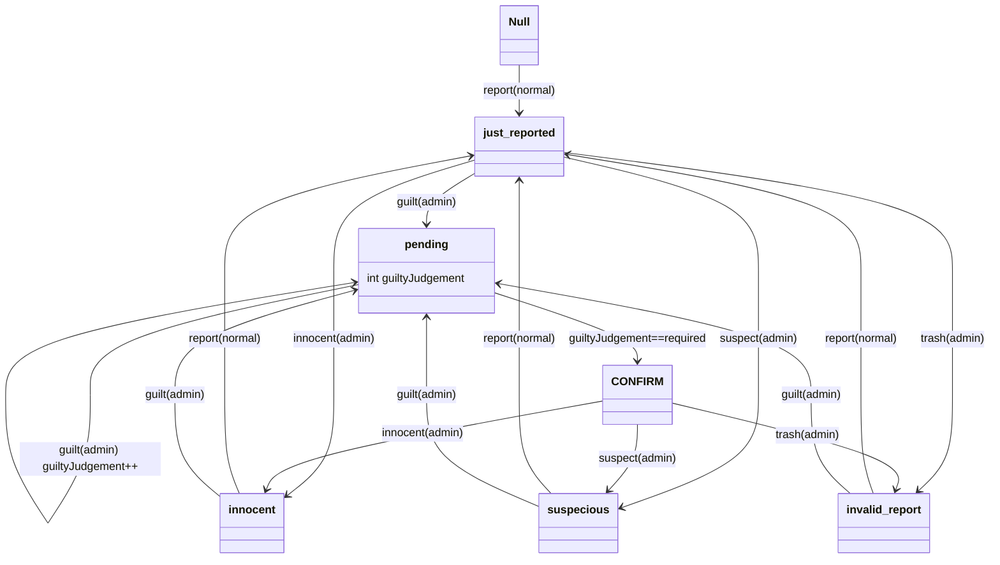

[TOC]

# BFBan 2.0 设计概要


BFBan 2.0 目的为在保留原网站功能下，改善

1. [验证码逻辑](#验证码逻辑)
2. 网站安全
3. [举报流程](#举报流程)
4. [origin客户端操作](#origin客户端操作)
5. [案件状态处理逻辑](#案件状态处理逻辑)
6. [搜索功能](#搜索功能)
7. [权限系统](#权限系统)

等方面，并新增

1. [用户网站账号与origin账号强制绑定](#用户网站账号与origin账号强制绑定)
2. [用户自定义，密码找回](#用户自定义，密码找回)
3. [消息系统](#消息系统)
4. [机器人系统](#机器人系统)
5. [公告系统](#公告系统)

等功能。

各功能实现及接口如下：

## 接口

#### 	获取验证码	/api/captcha

```javascript
REQUEST: HTTP GET /api/captcha
RESPONSE: HTTP 200 OK
body:	{
        	success: 1, 
        	code: 'captcha.gen',
        	data: {
    			hash: string, // encrypted captcha
            	content: string // svg image
        	}
    	}
```

#### 	获取站点统计信息	/api/statistics

```javascript
REQUEST: HTTP GET /api/statistics
parameters: reports? : ''	// show reports number
    		players? : ''	// show players that is reported number
    		confirmed? : ''	// show confirmed number
    		registers? : ''	// show register number
    		banappeals? : ''// show ban appeals number
    		details? : ''	// show number of each game, each status
    		from? : number	// stats from when? unix timestamp
RESPONSE: HTTP 200 OK
body:	{
    		success: 1,
            code: 'statistics.success',
            data: {
                reports?: number
    			players?: number
    			confirmed?: number
    			registers?: number
    			banappeals?: number
    			details?: {
                    byGame: {
                        bf1: number,
                        bfv: number,
                        ...
                    },
                    byStatus: {
                        1: number,
                        2: numebr,
                        ...
                    }
                }
            }
		}
```

#### 	获取网站最近活动	/api/activities

```javascript
```

#### 	获取网站公告 /api/announcements

```javascript

```

#### 获取网站管理员列表 /api/admins

```javascript
REQUEST: HTTP GET /api/admins
REPONSE: HTTP 200 OK
body:	{
    		success: 1,
            code: 'getAdmin.success',
            data: [
                {
                    id:number, 
                    username:string,
                    originName:string,
                    originUserId:string,
                	privilege:string
                },
                ...
            ]
		}
```

#### 	获取被举报玩家列表	/api/players

```javascript
REQUEST: HTTP GET /api/players
parameters:	game?: ''|'bf1'|'bfv'	// specify the game('' all)
			createTime?: number	// create from when(unix timestamp)
			updateTime?: number // update from when(unix timestamp)
            status?: -1|0|1|2|3|4|5	// the status the player is in(-1 all)
			sort?: 'createTime'|'updateTime'|'viewNum'|'commentNum'
            limit?:	number
			skip?: number
RESPONSE: HTTP 200 OK
body:		{
                success: 1,
                code: 'players.ok',
                data: {
                    result: [	// the player details
                        {
                            id: number,
                            originName: string,
                            originUserId: string,
                            originPersonaId: string,
                            games: string,
                            cheatMethods: string,
                            avatarlink: string,
                            viewNum: number,
                            commentsNum: number,
                            status: number,
                            createTime: string(ISODate),
                            updateTime: string(ISODate)
                        },
                        ...
                    ],
                    total: number	// the number of all results
                }
            }
```

#### 	搜索被举报玩家名字及历史名字	/api/search

```javascript
REQUEST: HTTP GET /api/search
parameters:	param: string	// the name need to search
RESPONSE: HTTP 200 OK
body:		{
    			success: 1,
                code: 'search.success',
                data: {
                    current: [	// current player has similar name
                        {
                            originName: string,
                            originUserId: string,
                            originPersonaId: string,
                            avatarLink: string,
                            status: number
                        },
                        ...100max
                    ],
                    history: [	// previous player names
                        {
                            historyName: string,
                            currentName: string,
                            originUserId: string,
                            originPersonaId: string,
                            log: {
                                from: string(ISODate),	// name log from
                                to: string(ISODate)		// name log to
                            },
                            status: number
                        },
                        ...100max
                    ]
                }
			}
```

#### 	搜索玩家当前名字	/api/advanceSearch

```javascript
REQUEST: HTTP GET /api/advanceSearch
headers:	x-access-token: {{access_token}}	// login required
parameters:	param: string	// the name need to search
RESPONSE: HTTP 200 OK
body:		{
    			success: 1,
                code: 'advSearch.foundOrigin'|'advSearch.foundBoth',
                data: {
                    originName: string,
                    originPersonaId: string,
                    originUserId: string,
                    avatarLink: string,
                    record: {	// foundBoth
                        currentName: string,
                        status: number,
                        cheatMethod: string,
                    }
                }
			}
    	  HTTP 404 NOTFOUND
          	{
                error: 1,
                code: 'advSearch.notFound',
               	message: 'No such player found on origin.'
            }
```

#### 	获取被举报玩家信息	/api/player

```javascript
REQUEST: HTTP GET /api/player
parameters:	OneOf [
    		userId?: string
			personaId?: string
			dbId?: number ]
			history?: ''
RESPONSE: HTTP 200 OK
body:		{
    			success: 1,
                code: 'player.ok',
                data: {
                    id: number,
                    originName: string,
                    originPersonaId: string,
                    originUserId: string,
                    games: string,
                    cheatMethods: string,
                    avatarlink: string,
                    viewNum: number,
                    commentsNum: number,
                    status: number,
                    createTime: string(ISODate),
                    updateTime: string(ISODate),
                    history?: [
                    	{
                    		originName: string, 
                        	fromTime: string(ISODate),
                            toTime: string(ISODate),
                		},
                    	...
                   	]
                }
			}
            
```

#### 	举报玩家	/api/player/report

```javascript
REQUEST: HTTP POST /api/player/report
headers:	x-access-token: {{access_token}}	// login required
body:	{
    		data: {
                game: 'bf1'|'bfv',
                originName: string,
                cheatMethods: string,	// see {{valid_cheatMethod}}
                videoLink:	string(url)|null,
                description: string
            },
            encryptCaptcha: string(base64),
            captcha: string				// captcha required
		}
RESPONSE: HTTP 201 CREATED
body:	{
    		success: 1,
            code: 'report.success',
    		data: {
                originName: string,
                originUserId: string,
                originPersonaId: string,
                dbId: number,
            },
            message: 'Thank you.'
		}
    	  HTTP 404 NOTFOUND
        {
            error: 1,
            code: 'report.notFound',
            message: 'Report user not found.'
        }
```

#### 	使用ID举报玩家	/api/player/reportById

```javascript
// TODO
```

#### 	获取被举报玩家案件时间线	/api/player/timeline

```javascript
REQUEST: HTTP GET /api/player/timeline
parameters:	OneOf [
    		userId?: string
			personaId?: string
			dbId?: number ]
RESPONSE: HTTP 200 OK
body:		{
    			success: 1,
                code: 'timeline.ok',
                data: {
                   	reports: [],
                    judgements: [],
                   	comments: [],
                    ban_appeals: [],
                } // TODO
			}
```

#### 	评论被举报玩家	/api/player/reply

```javascript
REQUEST: HTTP POST /api/player/reply
headers:	x-access-token: {{access_token}}	// login required
body:		{
    			data: {
                    toPlayerId: number,
                    toCommentType?: 0|1|2|3,	// 0-reply 1-report 2-judgement 3-banAppeal
                    toCommentId?: number,
                    content: string,
                }
			}
RESPONSE: // TODO
```

#### 	更新被举报玩家信息	/api/player/update

```javascript
REQUEST: HTTP POST /api/player/update
headers:	x-access-token: {{access_token}}	// login required
parameters:	OneOf [
    		userId?: string
			personaId?: string
			dbId?: number ]
RESPONSE: // TODO
```

#### 	给予被举报玩家判定	/api/player/judgement

```javascript
REQUEST: HTTP POST /api/player/judgement
headers:	x-access-token: {{access_token}}	// login required, admin privilege
body:		{
    			data: {
                    toPlayerId: number,
                    cheatMethod: string,	// see {{valid_cheatMethod}}
                    action: 'suspect'|'innocent'|'dicuss'|'guilt'|'kill'// super
                    content: string
                }
			}
RESPONSE: // TODO
```

#### 	为被举报玩家提出申诉	/api/player/banAppeal

```javascript
REQUEST: HTTP POST /api/player/banAppeal
headers:	x-access-token: {{access_token}}	// login required
body:		{
    			data: {
                    toPlayerId: number,
                    content: string
                }
			}
RESPONSE: // TODO
```

#### 	网站注册	/api/user/signup

```javascript
REQUEST: HTTP POST /api/user/signup
body:		{
    			data: {
                    username: string,
                    password: string,
                    originEmail: string(email),	// must match the originName below
                    originName: string	// must have one of bf series game
                },
                encryptCaptcha: string(base64),
            	captcha: string				// captcha required
			}
RESPONSE: HTTP 201 CREATED
body:		{
    			success: 1,
                code: 'signup.needVerify',
                message: 'Verify Email to join BFBan!'
			}
email:		'Hello ${username} ... link: htttps://xxxxx/xxx?code=${code}'
```

#### 	网站注册验证	/api/user/signupVerify

```javascript
REQUEST: HTTP GET /api/user/signupVerify
parameters:	code: string,
RESPONSE: // TODO
```

#### 	网站登录	/api/user/signin

```javascript
REQUEST: HTTP POST /api/user/signin
body:		{
    			data: {
                    username: string,
                    password: string,
                   	EXPIRES_IN?: number(ms)	// bot/dev account required
                },
                encryptCaptcha: string(base64),
            	captcha: string				// captcha required
			}
RESPONSE: HTTP 200 OK
body:		{
    			success: 1,
                code: 'signin.success',
                data: {
                    userinfo: {
                        username: string,
                        userId: number,
                        privilege: string,
                        signWhen: string(ISODate),
                       	expiresIn: number(ms)
                    },
                    token: string(jwttoken)	// for x-access-token
                },
                message: 'Welcome back.'
			}
```

#### 	绑定网站账号至origin账号	/api/user/bindOrigin

```javascript
REQUEST: HTTP POST /api/user/bindOrigin
headers:	x-access-token: {{access_token}}	// login required, no blacklisted
body:		{
    			data: {
                    originEmail: string,
                    originName: string
                },
                encryptCaptcha: string(base64),
            	captcha: string				// captcha required
			}
RESPONSE: // TODO
```

#### 	网站登出	/api/user/signout

```javascript
REQUEST: HTTP POST /api/user/signout
headers:	x-access-token: {{access_token}}	// login required
RESPONSE: HTTP 200 OK
body:		{
    			success: 1, 
                code: 'logout.success', 
                message: 'bye~'
			}
```

#### 	获取用户信息	/api/user/info

```javascript
REQUEST: HTTP GET /api/user/info
parameters:	id:number
RESPONSE: HTTP 200 OK
body:		{
    			success: 1, 
                code: 'userInfo.success', 
                data: {
            		username: string,
            		privilege: string,
            		introduction: string,
            		joinTime: string(ISODate),
            		lastOnlineTime: string(ISODate),
            		origin: ?{originName: string, originUserId: string}, // user privacy settings allow
            		attr: {
                        showOrigin: boolen,
                       	allowDM: boolen,
                        certUser: string,
                        freezeOfNoBinding: boolen
                    }
            		reportnum: number,
        		}
			}
```

#### 	获取自身信息	/api/user/me

```javascript
REQUEST: HTTP GET /api/user/me
headers:	x-access-token: {{access_token}}	// login required
RESPONSE: HTTP 200 OK
body:		{
    			success: 1, 
                code: 'userInfo.success', 
                data: {
            		username: string,
            		privilege: string,
            		introduction: string,
            		joinTime: string(ISODate),
            		lastOnlineTime: string(ISODate),
            		origin: {originName: string, originUserId: string},
            		attr: {
                        language: string,
                        showOrigin: boolen,
                       	allowDM: boolen,
                        certUser: string,
                        freezeOfNoBinding: boolen,
                        changeNameLeft: number,
                    }
            		reportnum: number,
        		}
			}
```

#### 	变更自身信息	/api/user/me

```javascript
REQUEST: HTTP POST /api/user/me
headers:	x-access-token: {{access_token}}	// login required
body:		{
    			data: {
                    introduction: string,
                    attr: {
                        language?: string,
                        showOrigin?: boolen,
                       	allowDM?: boolen,
                    }
                }
			}
RESPONSE: // TODO
```

#### 	变更账号名字	/api/user/changeName

```javascript
REQUEST: HTTP POST /api/user/changeName
headers:	x-access-token: {{access_token}}	// login required
body:		{
    			data: {
                    newname: string
                }
    			encryptCaptcha: string(base64),
            	captcha: string					// captcha required
			}
RESPONSE: // TODO
// You are logged out after this!!!
```

#### 	变更账号密码	/api/user/changePassword

```javascript
REQUEST: HTTP POST /api/user/changePassword
headers:	x-access-token: {{access_token}}	// login required
body:		{
    			data: {
                    newpassword: string,
                    oldpassword: string
                }
			}
RESPONSE: // TODO
// You are logged out after this!!!
```

#### 	忘记密码重设	/api/user/forgetPassword

```javascript
REQUEST: HTTP POST /api/user/forgetPassword
body:		{
    			data: {
                    username: string,
                    originEmail: string
                }
			}
RESPONSE: HTTP 200 OK
body:		{
    			success: 1, 
                code: 'forgetPassword.needVerify', 
                message: 'check your email to reset the password.'
			}
email:		'Hello xxx, xxxx link:htttps://xxxx/xxx?code=${code}'
```

#### 	忘记密码重设验证	/api/user/forgetPasswordVerify

```javascript
REQUEST: HTTP GET /api/user/forgetPasswordVerify
parameters:	code: string,
RESPONSE: HTTP 200 OK
body:		{
    			success: 1, 
                code: 'forgetPassword.success', 
                data: {
            		newpassword: string
		        }
			}
```

#### 	获取消息通知	/api/message

```javascript
REQUEST: HTTP GET /api/message
headers:	x-access-token: {{access_token}}	// login required
parameters:	box?: 'in'|'out'|'announce'
			skip?: number
			limit?: number
            from?: number(unix timestamp)
RESPONSE: // TODO
```

#### 	发送消息	/api/message

```javascript
REQUEST: HTTP POST /api/message
headers:	x-access-token: {{access_token}}	// login required
body:		{
    			data: {
                    toUserId: number,
                    type: 'direct'(normal)|'warn'(admin)|'fatal'(super)|
                          'toAll'(super)|'toAdmins'(super)|
                          'toNormals'(super),'command'(admin,dev)
                    content: string
                }
			}
RESPONSE: // TODO
```

##### 命令

##### webhook操作

```bash
webhook subscribe <eventName> <url> <key>		#RETURN: uuid
webhook unsubscribe <uuid>
webhook ls										#RETURN: {url,event,userId,key}[]
```

##### 用户权限修改

```bash
user grant <id> <role>
user revoke <id> <role>
user ban <id>
```

##### 评论举报等内容修改

```bash'
comment <reply|report|judgement|banAppeal> <id> <content> [videolink(report)]
```

##### 用户属性获取修改	

```bash
attr show <id> [path]					#RETURN all keyvalue OR value of specify path
attr set <id> <path> [val]				# set specify path with value or clear it
```

#### 	标记消息	/api/message/mark

```javascript
REQUEST: HTTP POST /api/message/mark
headers:	x-access-token: {{access_token}}	// login required
parameters:	id: number
			type: 'read'|'unread'|'del'
RESPONSE: // TODO
```


## 实现

### 验证码逻辑

##### 原

​	原验证码由 `svg-captcha` 库生成，并将验证码原码+过期时限加作为客户端cookie，同时发送验证码图片，客户在读出验证码后，将填写的验证码与加密cookie一并提交回服务端，服务端解密验证是否匹配及是否过期，完成验证码流程。

​	该方案存在三个严重问题，1. 可利用同一个验证码加密cookie进行重放攻击，只要时效还在，服务端就无法判断该验证码是否被提交过，据此可导致批量注册/举报攻击。 2. 加密字串作为cookie在客户端及服务器之间传输，由于前后端分离，浏览器严格的同域政策极易拦截cookie，使验证失败。3. svg-captcha 库由于自身算法问题，生成的验证码已能被准确识别

##### 现

​	现采取改良算法的 `svg-captcha-fixed` 库生成验证码，并将验证码原码+过期时限按rest风格返回客户端，具体存储方式由客户端决定，客户在读出验证码后，将填写的验证码与加密字串一并按rest风格返回服务端。服务端解密判断是否匹配，是否过期，并在数据库 `used_captchas` 表中寻找相同的加密字串，由于每个加密字串生成时内容不等，其结果亦不可能相等，故如寻找到相同字串，则证明该验证码已使用过，返回错误。验证成功则将验证码存入 `used_captchas` 表中。由于该过程需要识别验证码成功后记录才会进入数据库(提交门槛)，且每个验证码存在有效期限，数据库可在验证码过期后将其清除，并不用担心再次被重用的风险(已经过期)，故数据量可控，较为安全

​	代码中将加密字串作为主键，过期时间作为表中另一个键，并设置定时任务扫表清除过期验证码

### 举报流程

##### 原

```sequence
Client->Server: /checkGameIdExist:originName
Note right of Server: checkGameIdExist(originName)
Server->Client: originName,userId,personaId,avatarlink | NotFound
Note right of Client: Found? continue
Client->Server: /report:originName,userId...,report detail,captcha
Note right of Server: checkGameIdExist(originName)
Note right of Server: compare, write report DB
Note right of Server: check status change, write cheater DB
Server->Client: 200 OK
```


​	该过程两次调用了`checkGameIdExist`，降低了效率，且中间将`personaId`，`avatarLink`交由客户端再次返回，既不高效也不可靠，同时`checkGameIdExist`接口需要调用origin搜索功能却没有任何门槛，容易被刷请求使正常请求时遇到origin频率限制406

##### 现

```sequence
Client->Server: /report:originName,report detail,captcha
Note right of Server: search(originName)
Server->Client: 404 NotFound
Note right of Server: Found? continue
Note right of Server: stateMachine(prev)->write player DB
Note right of Server: write report DB
Server->Client: 200 OK, originUserId...
```

​	该过程仅一次调用origin查询API，并引入了多api联合查询，同时向多方由名字查询origin数据的api发送请求，收到最快返回的即可进行下一步处理，增加了可靠性同时减少了耗时，且调用外部api方面设置了用户登录，验证码两个门槛，滥用概率大大降低。引入案件状态机，使状态处理码量降低

### origin客户端操作

##### 原

​	原实现仅允许使用一个账号。

##### 现

​	将origin客户端对象化，每个origin客户端懒维护自身authtoken，即每次请求前判断authtoken是否过期，过期则自动重获取，未过期则直接请求，新增搜索邮箱方法，新增获取玩家游戏列表方法，新增origin客户端集群对象，每次需请求时可按队列抽出一origin客户端对象使用，大大降低了被origin 406频率限制的概率

### 案件状态处理逻辑

##### 原

​	`if else if ` 

##### 现

​	将各状态，及各状态转移条件作图，状态为点，条件为路径



将 (当前状态，(操作，权限)) 输入进状态机，状态机则检查是否存在对应路径，存在则行动(返回下一个状态)，不存在则停留(返回当前状态)

### 搜索功能

##### 原

​	无频率，搜索结果数量限制，使搜索API易被滥用。另搜索时无法搜索玩家最新名字，搜索得出的旧名会出现重名现象，不好区分

##### 现

​	加入搜索结果数量限制，查询旧名时联合`name_logs`表和`players`表，同时显示旧名新名。增加高级搜索功能，调用originAPI查询最新用户名，仅对注册用户开放，并严格控制使用频率。

### 权限系统

##### 原

​	一个用户一个角色，有 `normal`, `admin`, `super`, `root` 四种角色

##### 现

​	一个用户多个角色，具体为`user`表内`privilege`字段使用`,`分开各角色，暂定有 `normal`, `admin`, `super`, `root`, `dev`, `bot` , `freezed`, `blacklisted`八种，其中`super`将拥有管理网站用户，管理用户评论的权限，`dev`, `bot`将拥有跳过验证码，使用限制更少或进阶的网站API权限，`dev`同时具有发布网站公告，审查部分用户数据的权限，`freezed`则针对未绑定origin账户的用户，禁止除自身外大部分操作，`blacklisted`则全部权限禁止，`root`则全部权限具有，由于一人可拥有多个角色，除含`freezed`, `blacklisted`的用户，权限取其并集

### 网站账号与origin账号强制绑定

##### 原

​	注册没有实际成本，极易大量注册刷爆数据库，注册用户可恶意评论，账号被封也能重新注册，造成不良后果的代价极低

##### 现

​	未注册用户:

```sequence
Note right of User: set EA privacy policy first
User->Server: /register username,password,originEmail,originName,captcha
Server->origin: search(originEmail)
origin->Server: userId
Server->origin: userInfo(userId)
origin->Server: returnName,persoanId...
Note left of Server: returnName==originName? hasBFgame?
Server->User: false: 404 no such player
Note left of Server: write register DB
Server->User: Email(register link:code)
User->Server: /registerVerify code
Note left of Server: register.has(code)?
Note left of Server: write register->user DB
Server->User: 201 Created
```

​	已注册用户：

​		权限加入 `freezed` 属性 `freezedOfNoBinding` 设置为 `true` ，绑定origin账号成功后撤回该权限属性

### 用户自定义，密码找回

​	`users` 表新增以下相关字段 `introduction` , `attr` , `originName` 前者为用户可自定义的介绍，后者为用户绑定的origin账户名，可由 `attr` 字段代表的属性中展示开关选择是否展示，管理员强制展示，`attr` 字段为JSON字符串，可存储使用频率较低的用户附加信息，部分属性用户可读可写，如展示开关，允许私信，偏好语言(日后邮件/通知等全球化)；部分属性用户可读不可写，如官方认证，剩余改名次数；部分属性用户不可读不可写，如最近登录IP

​	得益于origin账户强制绑定，我们可以拿到用户邮箱作为密码找回的方法。为了省去专门页面和数据库表(懒)，步骤如下

```sequence
User->Server : /forgetPassword username,email,captcha
Note left of Server: match(username,email)?
Note left of Server: newPassword=randomBytes(16)
Server->User : Email( link:code=Encrypt(newPassword,userId) )
User->Server : /forgetPasswordVerify code
Note left of Server: Decrypt(code)->DB.update(newPassword).where(id)
Server->User : 200 OK , newPassword
User->Server : Login with new password then reset
```

该方法较直接重设并发送新密码至用户邮箱，能避免恶意者得知用户绑定邮箱后，不断触发忘记密码使用户密码不断重置，使用户无法登录

### 消息系统

​	消息系统实现了简陋的通知、交流、命令功能。收发方面，考虑到实现难度和对及时性需求不高，为http的get/post，其中收在消息界面使用15s一次的轮询，在其他界面则回退至5min一次的轮询。

数据库方面，设计为

| fromUserId  |  toUserId   |  type  | content | haveRead | createTime |
| :---------: | :---------: | :----: | :-----: | :------: | :--------: |
| null \| int | null \| int | string | string  |  boolen  |    Date    |

凭借type为字符串类型，消息除了`direct` `reply` `info` `warn` `fatal` 之类对单人的消息外，还加入了`banappeal`(对管理员并可取消) `toAll` `toAdmins` `toNormals` 等对多人的消息，除此之外，还有为命令系统而做的`command`类型

`direct`类型消息为用户直接的直接消息，用户A 向 用户B 发起直接消息需要 用户B 的属性`allowDM`为`true`；`reply`类型为 用户A 在案件中回复 用户B 由 系统 向 用户B 发送的消息，不允许私信不会阻拦该消息；`info`,`warn`,`fatal`为管理员/系统向用户发出的通知，其中`fatal`类型无法由接收用户主动删除；`toAll`,`toAdmins`,`toNormals`字面意思，由管理员/系统向多个人发出的通知；`banappeal`类型为投递申诉时对全体管理的通知，在3个管理确认阅读申诉后可消除；`command`为命令专用消息，目前设计命令可：订阅webhook(开发者 root)、设置用户权限(管理员 超级管理员 root)、编辑举报回复等内容(超级管理员 root)、编辑/查看用户属性(开发者 超级管理员 root)

### 机器人系统

##### Webhook系统

```none
啥是Webhook：
	https://zh.wikipedia.org/wiki/%E7%BD%91%E7%BB%9C%E9%92%A9%E5%AD%90
```

​	Webhook系统为 被举报玩家状态改变、新用户注册、申诉、被举报玩家名字追踪 等事件提供了主动通知订阅者的功能，使订阅者无需轮询并处理重复数据及时收到推送，使用此系统将可以极大的拓展网站的功能

订阅Webhook通过消息系统中的命令部分执行，考虑到开销，每个账号仅允许注册5个 事件-url，注册时，用户需提供监听的事件名、接受推送的url、验证key，命令系统将返回一串uuid，用于标识该 事件-url 订阅，并作为取消订阅的凭据。同样由于开销，事件在触发后并不会直接发送推送，而是缓存于发送缓冲区中，每30s集体发送一次。另外，为了不暴露主机ip，同时减少主机请求数，消息将与所有订阅url打包提交至cloudflare worker并由其转发至各个订阅地址，所以该系统无法保证投递消息的ip不变及可控，所以请务必在注册时提供强度高的验证key，届时发送消息时此key将会附加于`token` HTTP头内以用于表示身份

##### 机器人友好

​	注册方面，`dev`开发者角色可自由创建新账号，无需进行网站账号与origin账号绑定。账号经由开发者增加了了`bot`权限后，该角色可在除登录外的过程中免除验证码，并在登陆时有定义登录有效时间的权限，可以一次登录指定过期时间2100年以实现一个access token用够终身，此外，该角色还享有较大的api调用频率容忍度，同时提供了部分api以用于大量数据的查询导出

### 公告系统

​	由于公告属静态资源的一部分，而更新较真正的静态资源要频繁得多，同时追求编写简单长得好看，计划采用 提交markdown至github网站repo下 -> github action渲染为html -> github action部署静态页面 -> 前端iframe展示 这一流程，不经过后端，但后端可实现一个简易的重定向api，以获取最新公告。此方案同样可应用于 有关页 帮助页 等静态页面


​	